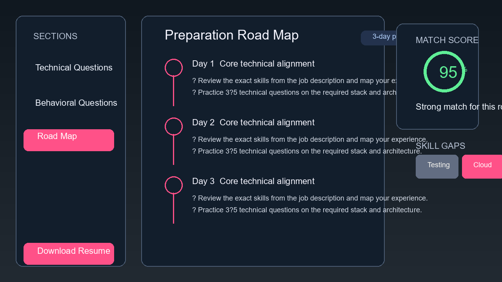

# AI Resume Builder

AI Resume Builder is a full-stack project that helps users create a personalized interview plan by analyzing a job description and a candidate profile.

## Features
- Job description input
- Self-description or resume upload
- AI-powered interview strategy generation
- Match score and skill gap analysis
- Preparation roadmap
- Resume PDF download

## Tech Stack
- Frontend: React + Vite
- Backend: Node.js + Express
- Database: MongoDB
- AI: Google Gemini API

## Project Structure
- `Frontend/` – React frontend
- `Backend/` – Express API and AI logic

## Getting Started

### 1. Install dependencies
```bash
cd Frontend && npm install
cd ../Backend && npm install
```

### 2. Set environment variables
Create a `.env` file in the `Backend` folder with:
```env
PORT=3000
MONGO_URI=your_mongodb_connection_string
JWT_SECRET=your_jwt_secret
GOOGLE_GENAI_API_KEY=your_google_gemini_api_key
```

### 3. Run the app
```bash
cd Backend && npm run dev
cd Frontend && npm run dev -- --host 0.0.0.0
```

## Screenshots

### Login Screen


### Home Screen


### Interview Report


## Notes
- The project is configured for local development.
- The `.env` file is intentionally ignored by Git for security.
