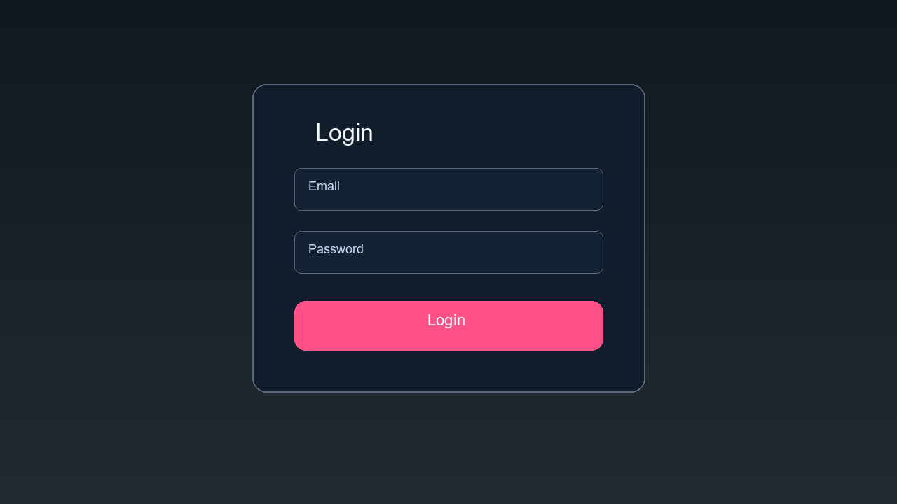
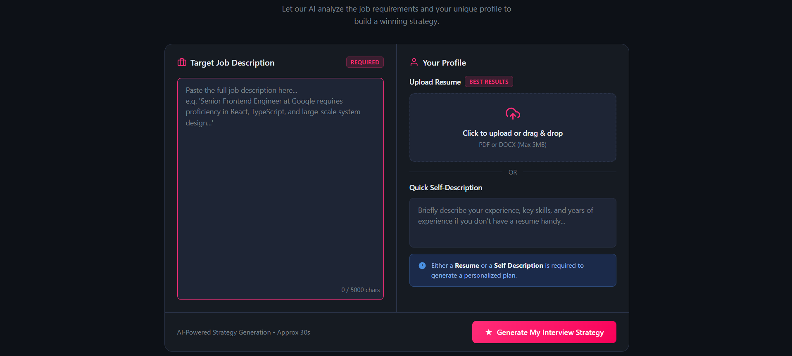
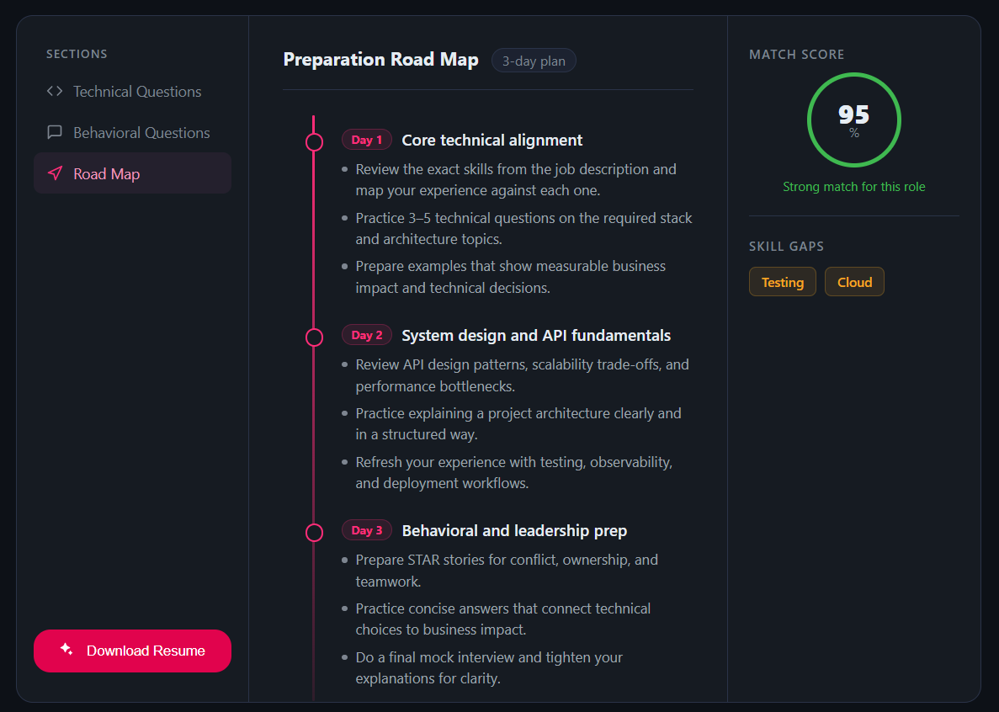
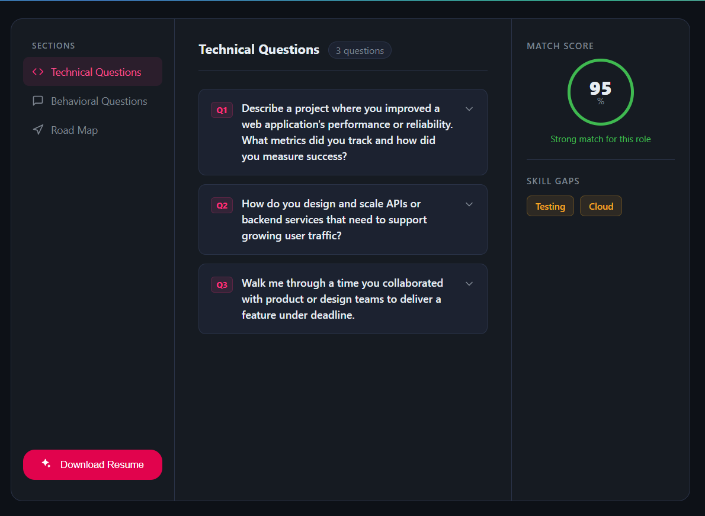

<div align="center">

# 🚀 AI-Powered Mock Interview Platform

**Tailored interview strategies, real-time match scores, and automated skill-gap roadmaps powered by Gemini AI.**

[](https://react.dev/)
[](https://nodejs.org/)
[](https://www.mongodb.com/)
[](https://ai.google.dev/)

</div>

---

## 📌 Overview

**AI-Powered Mock Interview Platform** bridges the gap between job descriptions and candidate preparation. By analyzing target job specifications against your resume or quick self-description, the platform generates personalized 3-day action plans, practice questions, match scores, and skill gap highlights in seconds.

---

## ✨ Key Features

* **🎯 Target Job Analysis** — Paste any Job Description (JD) to extract primary requirements and core technical stack.
* **📄 Smart Profile Ingestion** — Upload your resume (PDF/DOCX) or provide a quick text self-description.
* **📊 Match Score & Skill Gap Analysis** — Get an immediate percentage match score along with identified skill gaps (e.g., Cloud, Testing).
* **🗺️ 3-Day Preparation Roadmap** — Dynamic day-by-day action plan covering technical alignment, API/system design, and STAR behavioral stories.
* **💬 Behavioral & Technical Questions** — Context-aware interview practice questions tailored directly to the targeted job role.
* **📥 PDF Resume Export** — Download tailored resumes optimized for the position.

---

## 🛠️ Tech Stack

### **Frontend**
* **Framework:** React.js (Vite)
* **Styling:** CSS3 / Modern UI Components

### **Backend**
* **Runtime:** Node.js
* **Framework:** Express.js
* **Database:** MongoDB

### **AI & Services**
* **AI Engine:** Google Gemini API (`@google/genai`)

---

## 📸 Application Screenshots

<table>
  <tr>
    <td align="center" width="50%">
      <b>1. Login Screen</b><br><br>
      
    </td>
    <td align="center" width="50%">
      <b>2. Home Screen (Job & Profile Input)</b><br><br>
      
    </td>
  </tr>
  <tr>
    <td align="center" width="50%">
      <b>3. Preparation Report & Roadmap</b><br><br>
      
    </td>
    <td align="center" width="50%">
      <b>4. Technical & Behavioral Questions</b><br><br>
      
    </td>
  </tr>
</table>

---

## 📁 Project Structure

```text
.
├── Backend/
│   ├── config/          # Database connection setup
│   ├── controllers/     # Route logic & AI strategy processing
│   ├── models/          # MongoDB schemas
│   ├── routes/          # Express API endpoints
│   ├── .env.example     # Environment variable template
│   └── package.json
│
├── Frontend/
│   ├── src/             # React components, styles, and context
│   ├── public/          # Static assets
│   └── package.json
│
└── assets/              # README screenshots & media
